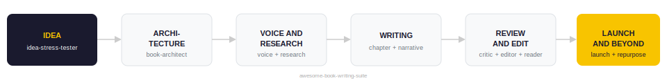

# awesome-book-writing-suite

A complete Claude-powered Book Writing Studio — 12 skills orchestrated by a single project prompt that takes an author from raw idea to published book to ongoing content engine.



---

## What this is

This is not just a collection of skills. It is a **fully orchestrated studio system** built on Claude Projects.

The `PROJECT_INSTRUCTIONS.md` file acts as the conductor — it knows which skill to invoke at each stage, how to hand off outputs between skills, how to run the chapter review loop, and how to track the author's progress across sessions.

The 12 skill files are the instruments. The project instructions are the score.

---

## Quick Start

### Set up the full studio (recommended)

1. Go to [claude.ai](https://claude.ai) → **Projects → New Project**
2. Name it `Book Writing Studio`
3. Open **Project Instructions** and paste the contents of [`PROJECT_INSTRUCTIONS.md`](PROJECT_INSTRUCTIONS.md)
4. Upload all 12 `.skill` files from the [Releases](../../releases) page into the project
5. Start a conversation — the studio will open with a first session intake

> The studio remembers your book, your voice, your chapter status, and your pipeline stage across every session.

### Use individual skills only

1. Go to [claude.ai](https://claude.ai) → **Settings → Skills**
2. Upload only the skills you need
3. Trigger each skill using the example prompts listed below

---

## The Pipeline

```
[1] idea-stress-tester
         ↓
[2] voice-calibrator
         ↓
[3] book-architect
         ↓
[4] narrative-spine-builder
         ↓
[5] research-evidence-builder   ← per chapter, as needed
         ↓
[6] chapter-builder             ← one chapter at a time
         ↓
[7] reader-journey-mapper  ┐
[8] red-team-critic        ├── Review & Polish Loop (per chapter)
[9] beta-reader-simulator  ┘
         ↓
[10] editor-sharpener
         ↓
[11] book-launch-kit
         ↓
[12] content-repurposer
```

Skills 7, 8, 9 and 10 form a **Review & Polish Loop** that repeats for every chapter: draft → red-team → beta-read → journey-map → edit → next chapter.

---

## The 12 Skills

### 💡 idea-stress-tester — *Pre-writing*
Attacks your book idea the way the market will — before you write a word. Produces a full stress-test report: failure modes, market saturation, competing angles, and a sharper rewrite of your core concept.

**Trigger:** `"stress test my idea"` · `"is my book idea good?"` · `"poke holes in this"` · `"why would this fail?"`

---

### 🎙️ voice-calibrator — *Pre-writing*
Extracts your precise writing voice from real samples and produces a Voice Fingerprint that plugs into every downstream skill — so every draft and edit sounds like you.

**Trigger:** `"calibrate my voice"` · `"write in my voice"` · `"it doesn't sound like me"` · `"build a voice profile"`

---

### 🏛️ book-architect — *Planning*
Guides you through a structured intake interview, then co-creates your book's positioning, unique angle, reader promise, and full chapter architecture.

**Trigger:** `"help me plan my book"` · `"create a chapter outline"` · `"I have an idea for a book"`

---

### 🧵 narrative-spine-builder — *Planning*
Builds the connective tissue between chapters — thesis evolution, chapter-to-chapter flow, intellectual progression arc, and a recurring motifs and callbacks system.

**Trigger:** `"build my narrative spine"` · `"my chapters feel disconnected"` · `"what's the throughline?"`

---

### 🔬 research-evidence-builder — *Research*
Finds, evaluates, and packages supporting material — data, case studies, counterarguments, expert citations, and real-world examples — at the book or chapter level.

**Trigger:** `"find evidence for this"` · `"I need a case study for chapter N"` · `"my chapter feels thin"`

---

### ✍️ chapter-builder — *Writing*
Takes chapter inputs (title, key ideas, word count, structure) and produces a fully written chapter — with story, logic, and examples woven together, calibrated to your voice and reader level.

**Trigger:** `"write Chapter N"` · `"draft this chapter"` · `"turn my notes into a chapter"`

---

### 📊 reader-journey-mapper — *Review*
Maps the reader's engagement curve across the entire book — identifying hook zones, drop-off risks, transformation moments, and dead zones chapter by chapter.

**Trigger:** `"map the reader journey"` · `"where will readers get bored?"` · `"where are the dead zones?"`

---

### ⚔️ red-team-critic — *Review*
A hostile intellectual reviewer that attacks reasoning quality, logical integrity, evidence standards, and intellectual rigour — not prose style, but the quality of the thinking itself.

**Trigger:** `"red team this"` · `"attack my argument"` · `"find the logical flaws"` · `"tear this apart"`

---

### 👤 beta-reader-simulator — *Review*
Reads your writing through the eyes of real reader personas — simulating comprehension, engagement, confusion, skepticism, and emotional response before you publish.

**Trigger:** `"simulate a beta reader"` · `"how will readers react?"` · `"where will I lose the reader?"`

---

### ✂️ editor-sharpener — *Polish*
A professional editorial skill covering clarity, flow, authority tone, fluff removal, structural editing, line editing, voice consistency, and pacing.

**Trigger:** `"edit this"` · `"make this sharper"` · `"remove the fluff"` · `"tighten this up"`

---

### 🚀 book-launch-kit — *Launch*
Produces every launch asset in one workflow: back-cover copy, Amazon description, author bio, social media content, email sequences, media kit, podcast pitch, and a 30-day launch plan.

**Trigger:** `"write my book blurb"` · `"build a launch plan"` · `"create a media kit"` · `"30-day launch plan"`

---

### 📣 content-repurposer — *Post-launch*
Extracts the intellectual capital from your book and rebuilds it as platform-native content — LinkedIn posts, Twitter/X threads, YouTube scripts, newsletters, and online courses.

**Trigger:** `"turn my book into LinkedIn posts"` · `"repurpose my book content"` · `"build a content engine"`

---

## Repo structure

```
awesome-book-writing-suite/
├── PROJECT_INSTRUCTIONS.md        # Studio orchestrator — paste into Claude Project
├── README.md
├── examples/
│   └── pipeline.svg
├── idea-stress-tester/
│   └── SKILL.md
├── voice-calibrator/
│   └── SKILL.md
├── book-architect/
│   └── SKILL.md
├── narrative-spine-builder/
│   └── SKILL.md
├── research-evidence-builder/
│   └── SKILL.md
├── chapter-builder/
│   └── SKILL.md
├── reader-journey-mapper/
│   └── SKILL.md
├── red-team-critic/
│   └── SKILL.md
├── beta-reader-simulator/
│   └── SKILL.md
├── editor-sharpener/
│   └── SKILL.md
├── book-launch-kit/
│   └── SKILL.md
└── content-repurposer/
    └── SKILL.md
```

---

## Contributing

Contributions are welcome! See [CONTRIBUTING.md](CONTRIBUTING.md) for guidelines.

## License

MIT — see [LICENSE](LICENSE) for details.
